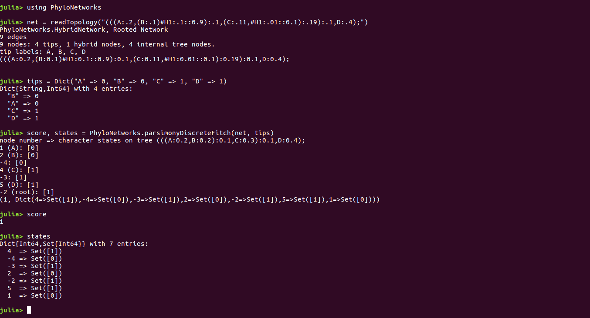

```{r, include=FALSE}
knitr::opts_chunk$set(echo = TRUE)
knitr::opts_knit$set(global.par = TRUE)
knitr::knit_engines$set(julia = JuliaCall::eng_juliacall)
```

# Abstract

Phylogenetic networks are graphical models that depict the process of evolution in a more accurate manner, in some situations, than phylogenetic trees by incorporating reticulate edges to represent episodes of horizontal gene flow. Unfortunately, computational methods for analyzing these more complex structures have lagged significantly behind their widespread acceptance as evolutionary models. In particular, character-based optimality criteria, including parsimony, are rarely applied to networks as they are to trees. This document describes methods extending the soft-wired parsimony algorithm for use with discrete characters on reticulate networks. These methods are part of the Julia programming language and are publicly available from the PhyloNetworks.jl package. 

# Overview

Phylogenetic trees are leaf-labeled bifurcating graphical structures that model the evolution of a set of taxa with the most recent common ancestor at the root and speciation events represented by internal nodes. Such models present an oversimplified view of the evolution of many lineages because they assume only a vertical transfer of genetic material. Incomplete reproductive barriers between taxa allow for interspecies recombinations. These events involving transfer of genetic material between lineages produce novel genetic combinations, resulting in complex evolutionary histories that cannot be accurately represented on trees. Reticulations (non-tree events) such as hybrid speciation or horizontal gene transfer create network edges that connect the nodes of different branches. The phylogenetic network extends the phylogenetic tree to model these events [@abbott2013hybridization, @cavender2015phylogeny, @givnish2010ecology]. 

Phylogenetic networks are directed, acyclic graphs aimed at representing episodes of horizontal evolution with the use of reticulate edges that connect nodes of different branches [@wainwright2008graphical]. Thus, they are structures accounting for episodes of horizontal gene transfer and hybridization, providing a much more complex, and ostensibly more accurate, representation of evolution in a given lineage. Hybridization is increasingly being recognized as a widespread process with a potentially major effect on speciation through introgression of adaptive gene combinations [@abbott2013hybridization]. Episodes of so-called “horizontal evolution” have been recognized as major events in the history of a wide assortment of lineages from plants to animals and even fungi [@abbott2013hybridization, @cavender2015phylogeny, @givnish2010ecology]. Reticulate evolution is also a major driver of diversification in an entire domain of life [@abbott2013hybridization] since bacteria obtain a large proportion of their diversity through horizontal gene transfer [@abbott2013hybridization]. While the idea of hybridization as a significant force explaining evolutionary history is being rapidly adopted, methods for visualization and analysis of phylogenetic networks are developing at a much slower pace.

PhyloNetworks is an open-source Julia language package providing tools for analysis of phylogenetic networks. PhyloNetworks provides methods for network estimation, visualization, and analysis [@solis2017phylonetworks]. Described here are newly available methods of ancestral reconstruction of discrete character states using parsimony. These functions that perform a lean and robust calculation of parsimony will be used to infer ancestral character states by mapping a single discrete character onto a phylogeny. 

# Big vs Small Parsimony

 Maximum Parsimony is still widely used as tree reconstruction method due to its simplicity and familiarity: the parsimony score for a given tree, sometimes referred to as “small parsimony”, can be tractably calculated using the well established Fitch algorithm [@fitch1971toward]. In contrast, finding the most parsimonious among a set of all possible trees, known as “big parsimony”, is an NP-hard problem. 

The `parsimonyDiscrete` function described here calculates the small parsimony of a given network with established topology.

# Soft-wired vs Hardwired Parsimony

There exist two basic types of phylogenetic networks that differ based on manner in which network edges are interpreted:

A soft-wired network has network edges that represent alternate evolutionary scenarios which can be resolved into binary trees. For each network edge, a network will contain at most two binary trees [@wheeler2015phylogenetic].

In contrast, Network edges in hardwired networks do not represent alternate evolutionary scenarios but rather potential transformations between multiple ancestors and a single descendant.

Methods, complexity of calculation, and outcome are determined differently parsimony depending on type of network to which the parsimony criterion is applied. While time complexity of soft-wired parsimony varies polynomially with the number of fixed network nodes, determining the hardwired cost is NP-hard with a number of character states greater than 2.

Soft-wired parsimony is more biologically relevant since it allows for multiple alternate evolutionary scenarios, in which episodes of of horizontal gene flow represent alternate tree scenarios and therefore alternate, but not necessarily co-occurring paths from ancestor to descendant for a given character [@fischer2015computing].

The `parsimonyDiscrete` function described here calculates the soft-wired parsimony score by first resolving the input network into binary trees.

# Extending Parsimony Analysis to Include Discrete Characters

There are several subproblems within the general parsimony problem of reconstructing the most parsimonious network from a set of data.  One such subproblem is calculating and optimizing the changes of state occurring in in each network. This is referred to as the small parsimony problem. For this problem, it is assumed that a tree topology and character states at the leaves are already given, and the problem is to find a most parsimonious assignment of character states to internal nodes. 

Parsimony, as an optimality criterion seeks to find the tree(s) with the
fewest number of evolutionary events. To accomplish this, we use a weighting scheme to
assign specific costs to each event and search for an evolutionary scenario with the least total
cost, the most parsimonious tree.

The traditional Fitch algorithm for reconstructing ancestral character states using the parsimony criterion can be easily modified to work with networks.  This algorithm uses a post-order tree traversal to minimize the number of evolutionary changes needed to explain the data [4, [@fitch1971toward]. A second, pre-order traversal is then performed in order to eliminate extraneous values previously determined in the post-order phase [@fitch1971toward]. Tree traversal is accomplished by means of a recursion.

The `discreteParsimonyFitch` function calculates the most parsimonious score of a soft-wired network of fixed topology given a set of discrete character states at the tips. This function also also return the union of all optimized character states at each internal node as obtained by Fitch algorithm. Tip data can be given in a data frame, in which case the taxon names are to appear in column 1 or in a column named "taxon" or "species", and trait values are to appear in column 2 or in a column named "trait". Alternatively, tip data can be given as a dictionary taxon => trait. The function operates by applying the Fitch algorithm to each node [9].

# Requirements and Software Installation

## Operating System requirements

Julia supports Windows, Mac, and Linux. The latter two operating systems are recommended since some methods in PhyloNetworks have not been tested in a Windows environment.

## Software Requirements 

[Julia](https://julialang.org/downloads/)

The latest release of Julia is available both as a binary and from source code

The most recent release of Julia supported by PhyloNetworks is v0.7.0


In order to run Julia from anywhere in a terminal, add the Julia executable to your path.

[PhyloNetworks.jl](https://github.com/crsl5/PhyloNetworks.jl)

In the Julia language REPL, type:
 `Pkg.add("PhyloNetworks")`
This will install PhyloNetworks and any necessary dependencies.

As of this writing, the most recent release of PhyloNetworks is v0.7.0

In the Julia language REPL, type:
 `Pkg.update()`
To update packages to the latest version

# Demonstration of a Simple Network

`discreteParsimonyFitch` returns the parsimony score of a given network along with a dictionary of optimal character states at each internal node:

```{r, engine='julia'}
using PhyloNetworks

net = readTopology("(((A:.2,(B:.1)#H1:.1::0.9):.1,(C:.11,#H1:.01::0.1):.19):.1,D:.4);")
tips = Dict("A" => 0, "B" => 0, "C" => 1, "D" => 1)
score, states = PhyloNetworks.parsimonyDiscreteFitch(net, tips)
```

Below is the step-by-step process to replicate these results




# Network Assumptions
The parsimony methods can be applied to a soft-wired network with known leaf states of a single discrete character.

A level-1 network, where each hybrid node is part of a single cycle, is assumed throughout,.
This assumption this made to limit the network complexity, since showed that sequence data and gene trees on present-day species do not contain enough information to reconstruct complex networks [@bryant2017quirks].

 Hybrid edge lengths are allowed to be 0, but not constrained to 0, even though each hybrid edge represents a gene flow event between contemporary populations. One reason for this is that if one parental population went extinct or has no sampled descendants, the hybrid edge from this parent has a positive length in the observable network. A second reason is that a long branch can fit a population bottleneck, as might be expected in the formation of a new hybrid species [@solis2017phylonetworks].

# References