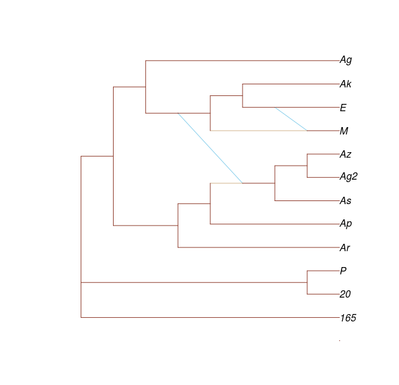
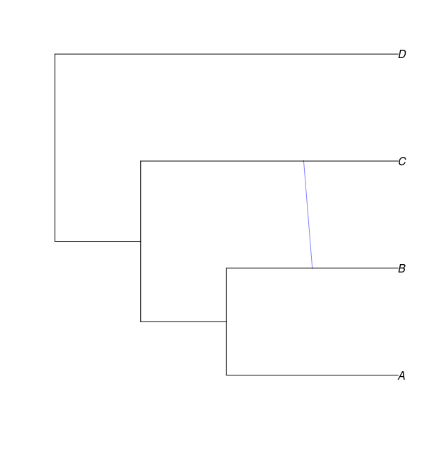

```{r, include=FALSE}
knitr::opts_chunk$set(echo = TRUE)
knitr::opts_knit$set(global.par = TRUE)
knitr::knit_engines$set(julia = JuliaCall::eng_juliacall)
```

# Overview

In the relatively new Julia programing language there exist very few tools that allow for the visualization of phylogenetic networks, especially compared to the more established language of R. Many network plotting functions developed in Julia utilize the `Gadfly.jl` package, which creates a separate graphing layer for each edge resulting in a fairly resource-heavy algorithm [@Gadfly]. Utilizing the RCall.jl package, which  allows Julia to utilize high-level graphical constructors present in various R libraries would allow for a leaner and more versatile plotting function. 

PhyloPlots has utilities to plot tree and network objects created using PhyloNetworks using plotting back-ends like Gadfly, and through R via the Julia package `RCall.jl`. PhyloPlots has several suites of function designed for communication in the Julia to R direction with the end goal of visualization [@RCall]. 

Specifically, building a S3 “phylo”-class object from the `HybridNetwork` objects created in the PhyloNetworks.jl package that can be passed from Julia to R allows Julia networks to be interpreted by the ‘ape’ library [@paradis2004ape]. This will allow PhyloNetworks users to utilize the versatility of ‘ape’ graphical tools from the Julia environment.

# RCall.jl

R is a programming language focused statistical computing and graphics that is well known for its comprehensive collection scientific and mathematical packages including a number of low- and high-level graphing utilities. RCall creates an R language environment within Julia, enabling Julia users call R libraries. This is especially useful since Julia lacks the robust package environment of R [@RCall].

# Network Visualization using RCall

Networks can also be displayed through R, using RCall instead of Gadfly by adding the argument :RCall after the network. One advantage to this is takes advantage of low level machinery in R for finer control over the final plot.

# Communication in the Julia to R Direction using RCall

## rput

Export a `HybridNetwork` object to the R language as an R Object of class `phylo` (and `evonet` depending on the number of hybridizations) recognized by the `ape` library in R (S3 object). This `RObject` can be evaluated using the tools available in the `ape` library in R. For example, we can visualize the network using `ape`'s `plot` function. evonet builds a network from a tree of class "phylo". There are print, plot, and reorder methods as well as a few conversion functions `rexport` produces a graph with high level graphing capabilities.

## sexp

A tree or network can also be exported with the `sexp` method and then displayed with R's "plot" and all its options.

This method uses the `$object ` syntax to use a Julia object in R. Export a HybridNework object to the R language as either `phylo` or `evonet` object (depending on degree of hybridization).

The `sexp` method uses helper functions defined in PhyloNetworks to create RObjects. An RObject is a Julia wrapper for an R object (known as an "S-expression" or "SEXP"). All R objects are stored in a common data type, the SEXP, or S-expression. What objects in R are really just symbols which are bound to a value. The value can be thought of as either a SEXP (a pointer), or the structure it points to, a SEXPREC [@RCall]. 

# Requirements and Software Installation

##Operating System requirements

Julia supports Windows, Mac, and Linux. The latter two operating systems are recommended since many methods in PhyloNetworks have not been tested in a Windows environment [@solis2017phylonetworks]

## Software Requirements 

[Julia](https://julialang.org/downloads/)
The latest release of Julia is available both as a binary and from source code
The most recent release of Julia supported by PhyloNetworks is v0.6.0

In order to run Julia from anywhere in a terminal, add the Julia executable to your path.

The following Julia packages must be installed:

[RCall.jl](https://github.com/JuliaInterop/RCall.jl)

In the Julia language REPL, type:
 `Pkg.add("RCall")`
This will install RCall and any necessary dependencies.
As of this writing, PhyloPlots works with RCall v0.10.6

[PhyloNetworks.jl](https://github.com/crsl4/PhyloNetworks.jl)
In the Julia language REPL, type:
 `Pkg.add("PhyloNetworks")`
This will install PhyloNetworks and any necessary dependencies.

As of this writing, the most recent release of PhyloNetworks is v0.7.0. PhyloPlots requires this release.

[PhyloPlots.jl](https://github.com/cecileane/PhyloPlots.jl)
In the Julia language REPL, type:
 `Pkg.add("PhyloPlots")`
This will install PhyloPlots and any necessary dependencies.

As of this writing, the most recent release of PhyloPlots is v0.1.0


In the Julia language REPL, type:
 `Pkg.update()`
To update packages to the latest version

[R](https://cran.r-project.org/)
Rcall will automatically install R using Conda if it does not detect the latest version of R (v3.4.0 at this writing)

Installing the following R packages is recommended for visualizing networks in R:  
[ape](https://cran.r-project.org/web/packages/ape/index.html)

v5.0 is required for network plotting utilities.

# Demonstrations on a Simple Network

## Network Visualization in R

Adding the argument :RCall after the network, will display the graph using R Graphics instead of Gadfly. Optional arguments offer greater control over the final graph:

```{r, engine='julia'}
using PhyloNetworks

net = readTopology("(((Ag,(#H1:7.159::0.056,((Ak,(E:0.08,#H2:0.0::0.004):0.023):0.078,(M:0.0)#H2:::0.996):2.49):2.214):0.026,(((((      Az:0.002,Ag2:0.023):2.11,As:2.027):1.697)#H1:0.0::0.944,Ap):0.187,Ar):0.723):5.943,(P,20):1.863,165);");

using PhyloPlots

plot(net,:RCall, edgeColor="tomato4",minorHybridEdgeColor="skyblue",
                 majorHybridEdgeColor="tan")
```



## Communication in the Julia to R direction 

The rexport function creates a `HybridNetwork` object using the `@rput` macro:

```{r, engine='julia'}
net = readTopology("(((A,(B)#H1:::0.9),(C,#H1:::0.1)),D);");
phy = rexport(net)

$Nnode

$edge

$tip.label

$reticulation

$reticulation.gamma

attr(,"class")

using RCall

phy

```


The `HybridNetwork` method for `sexp` can also be used to export Julia `HybridNetwork` objects to R 

```{r, engine='julia'}
using PhyloNetworks

net = readTopology("(((A,(B)#H1:::0.9),(C,#H1:::0.1)),D);")

using PhyloPlots

$net

```




# Assumptions

A level-1 network, where each hybrid node is part of a single cycle, is assumed throughout [@solis2017phylonetworks].

# References
